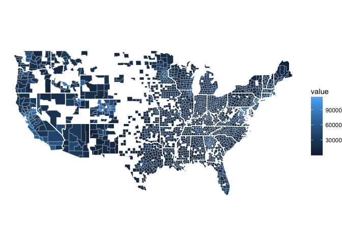
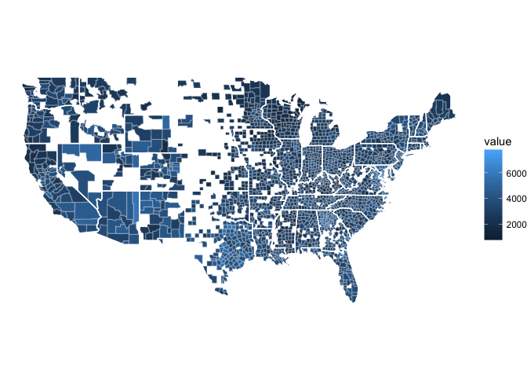
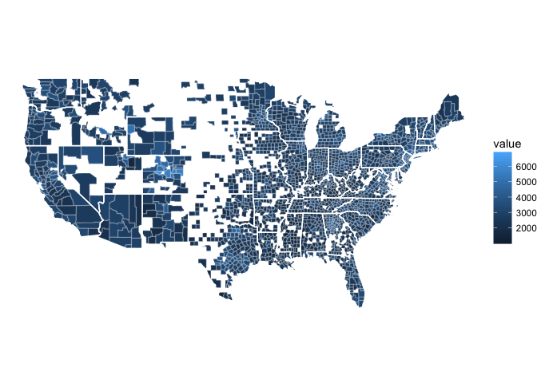

Household Credit: County Maps
================

``` r
pklist <- c("tidyverse", "data.table", "maps", "curl")
source("https://raw.githubusercontent.com/fgeerolf/R/master/load-packages.R")
source("https://raw.githubusercontent.com/fgeerolf/datasets/master/frb-ny/household.credit.R")
source("https://raw.githubusercontent.com/fgeerolf/R/master/map.countyfips.R")

household.credit.2006 <- household.credit %>%
  filter(year == 2006) %>%
  dcast(fips ~ variable, value.vars = "value")

map.countyfips(household.credit.2006 %>% select(fips, value = mortgage))
```



``` r
map.countyfips(household.credit.2006 %>% select(fips, value = auto))
```



``` r
map.countyfips(household.credit.2006 %>% select(fips, value = creditcard))
```


